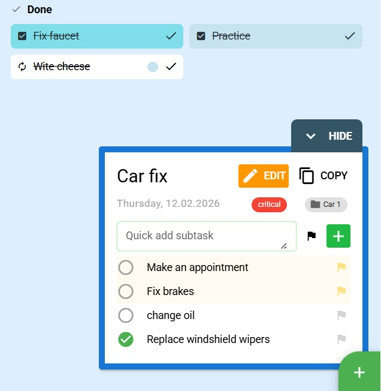
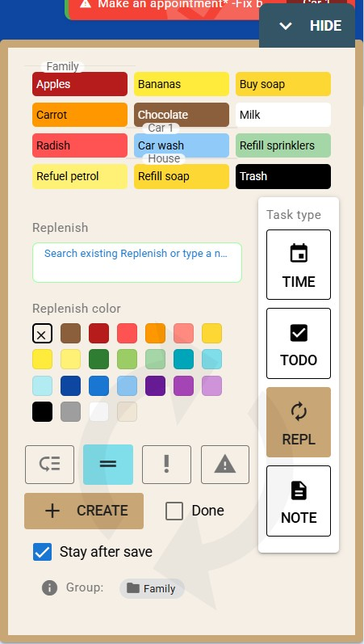

Copyright (c) 2026 Jacek Miszczuk. All rights reserved.

# Community Organiser 21 - CO21

Don't recommend it yet. Too early development progress, however it its very useful a specially calendar, and making project notes inside project groups. I'll make some final Readme.md closer to version 0.9 of app.

---

The main goal of this application is to simplify organization for families and communities; in its current state it serves as a personal organizer for events and tasks.

The application is designed to work primarily offline—even in environments with no internet access—and is not constrained by the storage limits common to some PWAs that rely on servers to continue operating.

I said myself that there is a lot of this type of software, but when I wanted to find a convenient one, one that I would even pay for, I couldn't find it - either for my own organization or for maintaining communities/groups/circles/school classes/bus trips (sending resources, maps, guides, around peer too peer networks, maybe some navigation helper, tracking tool for schools - with small optimal not hidden process).

Visually, I focus on readability. Of course, the layout is not finished, especially the margins and the backgrounds here and there, but instead of giving one or two matching colors, I prefer to use distinctive colors to immediately know where to look, what group is active. Currently the layout is a bit too bright,
due to muted colors on one of the screens.

Apart from comfort/expression, I will try to implement the so-called immersion so that the appearance is not a patchwork of typical form and list control components.

This will also be the basis for the so-called smart houses, for now only within the information board and tablet/screen with announcements.

---

Second reason to create this app was to check what AI/Copilot would generate without any engineering tips and refactor it later. UX development and app features were 1st, now as usual opinion "vibe code" like attempt do many mess,... but it works fine. It was hard to not show AI that for example whole app is initiating 7 times, solution also wasn't best. AI does'nt like DRY - it likes very much to repeat itself, whatever AI model it was.

## Name and ideology

The ideology is to make easier organisation lifes, and connect some internal devices inside house, meeting room or star-ship - without required payments / advertisments, but it could make some money for itself other ways.

The chosen name, CO21, stands for Community Organiser with the number chosen as a distinguishing element. Human communities are emitting CO2 so its maybe not so bad name, but probably chemically CO21 would be toxic or neutral or just impossible atomic structure. The logo is an initial design created in Inkscape.

## Main features

1. Time-based tasks — scheduling meetings, reminders about upcoming events, vehicle insurance renewals, expiring ID documents, task deadlines, cyclic events etc.
2. To-do tasks — items not yet tied to a specific time. Each task can later be associated with time; simple task/subtask lists are supported. Subtasks are created by prefixing lines with "-". The app can recognize pasted lists and detect subtasks without modifying the original text; a marker appears only when a subtask is marked complete.
3. Shopping lists and replenishment tasks — items marked with colors at creation or edit time. For example, a chocolate item can be given a chocolate color and later re-added from a quick search. These tasks use a minimal visual style and appear alongside general tasks and events to avoid checking multiple views.
4. Groups module — flexible structure, for example: Family -> car, home, child A, child B, parent -> parent's hobby. Tasks flow according to settings: tasks from direct children groups are included in the parent group, while deeper tasks (e.g., a hobby) are deemphasized; time reminders are not ignored. You can change active group and set view with filtered list
5. Calendar module — designed to make it easier to understand time gaps; recurring tasks illustrate routines. Holidays also appear and are currently the main feature that may use the internet (optionally). Holiday data is fetched once for a two-year window from the current year and then stored locally.
6. Task, event and shopping list view — allows expanding task details.
7. Reminder bar at the top — a persistent expandable line to prevent forgetting and to highlight upcoming events.

## App guide

Below are a few screenshots from the in-app guide (files available in `public/app-guide`).

<p align="center">
  
</p>

| Ways to complete task/subtask, as whole task or list edited anywhere like:

-Make an appointment*<br/>
-Fix brakes*<br/>
-change oil <br/> -[x] Replace windshield wipers |

<p align="center">
  
</p>

| Replenishment list - with universal input used as:
a) using as searching/selecting element already created items
b) is used as name of new item |

<p align="center">
  
</p>

## Compatibility

This project is in early development and is tested mainly at small laptop-like and large-screen resolutions. Many adjustments aim to provide a mobile layout suitable for Android, and later possibly iOS and Linux.

## Next steps

- Make App more useful, use it, improve UX crucial fixes. Code isn't first, but app usage experience is, at least at this point.
- Fix less important issues, and organize and clean up the codebase. Refactor has began and its long way, when engineering was skipped during creation process with Copilot/VsCode mostly ChatGPT5 + sometimes Claude Sonnet. It would be maybe nice way to learn how to fix vibe/spaghetti, but rather also with AI automation, and maybe later with another solutions.
- after some stage of project refactor, use some experimental project structure, try to make something more convenient than typical Vue or Laravel projects, a specially optimize it for AI usage + understanding project, or just agree with AI
- Finish Bluetooth data synchronization between devices
- Mobile application - and finish layout details, a specially buttons inside task creation form.
- User and permission system, mainly to dedicate a home tablet that displays the family's task schedule without requiring data restores
- Complete the notes module for contacts, planning, recording vehicle repair costs, tracking storage locations for important items, lending items, and a small community-fee/treasurer feature
- API and plugins. At this moment there is one test plugin which is just effect of my looking around

## Project installation instructions (generated by AI)

- **Frontend**: Quasar Framework v2 (Vue 3, TypeScript)
- **Desktop**: Electron
- **Styling**: Quasar Components
- **Data Storage**: JSON files (Electron) - planned data sync with server database API, and maybe i'll change my mind to save it inside some lite DB in Electron offline mode.

## Getting Started

### Install the dependencies

```bash
npm install
# or
yarn install
```

### Development

#### Start the Electron desktop app

```bash
npm run electron
```

### Production

#### Build for Electron (desktop)

```bash
npm run build:electron
```

### Code Quality

#### Lint the files

```bash
npm run lint
# or
yarn lint
```

#### Format the files

```bash
npm run format
# or
yarn format
```

## Automated tests

- **Unit tests (Vitest):** located in `tests/unit`. Run unit tests with:

```bash
npm run test:unit
# or
yarn test:unit
```

- **End-to-end tests (Playwright):** located in `tests/e2e`. Run e2e tests with:

```bash
npm run test:e2e
# or
yarn test:e2e
```

- **All tests / quick run:**

```bash
npm test
# or
yarn test
```

(Test mostly manual, but app is growing... so something is already installed. With mobile app execution time profiling would be most wanted)

- **Coverage:** Vitest coverage is configured — to run coverage for unit tests:

```bash
npm run test:unit -- --coverage
```

- **Notes & guidelines:**
  - Ensure dependencies are installed (`npm install` / `yarn install`).
  - Place unit tests in `tests/unit` and e2e tests in `tests/e2e`.
  - Keep tests small and focused; mock external services where appropriate.
  - Use `tests/setup.ts` for common test setup/teardown (already present).
  - Consider adding a CI workflow (GitHub Actions or similar) to run tests on PRs.

## Data Storage

- **Desktop (Electron)**: Data is automatically saved to `%APPDATA%/community-organiser/`

## Configuration

See [Configuring quasar.config.js](https://v2.quasar.dev/quasar-cli-vite/quasar-config-js) for customization options.

## About the code and application design (notes)

The development process can be broken into stages:

1. Choosing technologies and confirming that a familiar framework is a good choice.
2. I might not have had as much motivation to build this app if I had not previously used AI to create a small Laravel project that proved practical with little effort. This time I decided to generate something larger and less typical mainly using prompts. I note that AI did not necessarily save time overall and may have even added work, although it allowed me to focus on things other than coding.
3. Stage three consisted mostly of "lazy" prompt input, concentrating on project thinking, design, appearance and user-facing features (with an intuition about where that would lead).
4. After the main features were implemented I stopped adding features and focused on tidying the app. In short, this stage could be called an Augean stable, though I do not entirely blame AI—many factors led to this state. Working on the architecture after AI-generated code can be interesting and also a logical puzzle or challenge.

## General talking about AI:

I know from many sources that AI is used for rather smaller things, smaller projects, smaller graphics, short videos, etc.

As for the code, there are a lot more uncertainties as there are newer and newer integrations within the code that are no longer just a "language" generator.
Apart from the question of what can be achieved with low-cost AI, another question arises. Can't AI be treated as a good tool for "expansion?" As part of technological expansion, I would talk about, for example, replacing horses with combustion cars. With the emergence of opportunities, instead of just replacing the horse, the potential translated into the construction of roads, further journeys, more less tiring journeys - so instead of ultimately slowing down the labor market, he raised the bar of what can be achieved.

I can certainly say from this experience of using AI that in many cases it speeds up work many times over,
which can be somewhat thought of as speeding up your work by installing an additional library written by someone rather than writing it from scratch.

Next, in the generation of graphics, code, etc., knowledge of the topic, distinguishing quality is often important, and a programmer or graphic designer is needed at least to refine the project.

## Conclusions after using AI prompts:

### GPT5.1 Mini | Copilot model 0x credits - 10$ per month + occasionally manual updates and maybe once Claude at beginning.

GPT5.1 mini isn't so bad but really annoying if You prefer some file structure and You were previously using better AI models. It would be mostly garbage code, mostly code would be inside single vue file without any recommendations - but it's enough good for some lvl of "vibe coding".

Most of Vue projects looks like "blocks scattered by a child on the floor", but with GPT5.1 Mini it looks much worse.

It would always try to use own "coding style", avoiding user recommendations. It has also short memory isn't cooperating best with git fast reversal changes methods.

It usually can write new feature destroying another one, a specially it likes to touch layout changes, "improving" in wrong way without asking. This thing could be probably most annoying for even every vibe coder.

Refactor is slow and very ineffective, git is really helpful.

Maybe with good instructions, knowing better limitations of AI it could be much more useful.

For example "API" maybe isn't best name for central part of code but its already used by plugins and it will be used for backend state sync, it already had some order - it was AI advice at some point of development.

At this point i'll name it Controller - next GPT5.1 suggestion - its maybe not bad name , but API is shorter name general definition is "Interface". I don't like naming anything Facade. In PHP its usually very confusing pattern doesn't explaining how something works in simply way, in reality Facade is also something empty/useless.

Controller probably same as API could not be the best name when im thinking about MVC/PHP typical backend tasks. Inside backend apps it's mostly used to extend routing REST endpoint choice, but maybe "Controller" name is something more than MVC, and stateless server APP is maybe best for static pages, not for responsive app.

Generally this app doesn't use typical URL/REST API/Page switch functionalities. View is controlled by responsive value changes. Changing active group is a bit different than switching url.

Probably i'll name most crucial file just Command Center - and use it around project as CC.group.setActive(...) or ctr.group - i haven't decided yet. Api logic for plugins would be probably limited, and maybe its a good choice to rename access points.

This part of code is already used by experimental plugin, which could be developed by external code creators, and probably it would be somehow exposed as as twin backend control system, with similar logic.

---

Im not 100% sure of design of this vibe code project directions, but once GPT5.1 suggested API as name of central app control system, but when i've decided to move state inside API it became more like Pinia store (but storage sounds more like module not good name for central control system/interface. It could be good also as some layer or object/class, but thinking about car as an store isn't convenient way).

Generally app would be controlling only state/storage but connection with camera,...etc, its not only some interface linking database.

Engine name would be convenient but probably it wouldn't be engine, just some kind of organizer core, central command system or something similar.

Task manager is maybe not correctly describing possible futures of this center, mostly time organization center, but it already is attracted by calendar feature in most cases. Possibly it could be extended by functionality of anty-theft system, trip organization with map functionality,...

There is also talking about single responsibility principle - i still need to make at least central points for modules and than split project into smaller cells.

GPT5.1 really doesn't likes names like "root" which is convenient name for me suggesting some recursive structure, i really want to avoid of typical names like index which are less objective like. App is hmm... too general name.

I have need to experiment with names make some nice own files structure ( a specially after refactor of GPT5.1 it could be different experience ).

---

- My concept is to try to make some functions map for AI - to avoid repeating code.

---

Just cant recommend GPT5.1 Mini for operations like: "refactor storage module - use same structure/way as task module". Even it was refactored by Claude, and GPT5.1 mini cant accept this way sometimes.

It needs smaller/simpler tasks for more effective results, to avoid "single file style".
Initial prompts, or just some refactor prompts could be a key to success. Generally AI doesn't like too long prompts. With too long text it could see some logical conflicts and it chooses to make 30% of the prompt. It likes to create smaller tasks by itself when prompt is too long. Maybe more notes could explain how to not touch for example sizes of list/elements wrappings, when there is only changed box-shadow under single element of the list. Its much harder to find wrong change a specially when another thing needs to be repaired.

---

There is also problem with AI knowledge about project - it has own versions of files - probably. It easily changes user improvements made manually. Also when it see some conflict it would probably change more code than it was asked for, its trying to solve problem from wrong direction for example: there was done some refactor, but unit tests were not updated. It changed refactored code instead of outdated unit tests.

---

Next problem is it doesn't use tools for auto-rename files. Renaming single file could be so long process and generally AI isn't very adapted to use tools. In most cases to run tsc or lint, or check unit tests by AI it needs to always check package.json - its repeating checking project every time structure instead of doing something instant.

---

I'm not very patient anymore to change filenames with AI, and a specially with GPT5.1. AI can do this after few attempts Claude or GPT5.1 but its not efficient. It has also problems with using replacement tools. Instead of replacing some text it will destroy file structure accidentally, it doesn't see IDE/VSCode error tools. It could only use console, which could do the same but not instantly. This really needs some optimization.

Why automatic tests could be bad for GPT5.1? Avalanche changes are not easy to control, GPT5.1 isn't automatically updating tests. For Claude this is much more obvious habit to update the automatic tests and execute it after changes.

---

There is also another problem when code is adjusted, fixed etc. It leaves unused code or incorrect fixes, which are doing nothing in project except making code heavier.

---

There are so many problems/scenario with code like this:

const groupObj = (groups.value || []).find((g: any) => String(g.id) === String(key));
if (groupObj) CC.group.active.activate(groupObj);
else CC.group.active.activate(String(key));

1. Its TypeScript but GPT5.1 really likes to make universal methods, which isn't very effective method. "any" is main type in this kind of TypeScript.
2. There is also second problem if there is an ID instead of object: searching/filtering should be build inside activate or activateById function. AI really multiplies code, likes to repeat itself. There are still many lines of code which are taking all loaded tasks/events with some dates instead of taking correct, flat list of tasks.
3. function/method names: active.activate() - its not bad, a specially if AI is writing code, but maybe it would be easier to use make shared "interface/taxonomy" and make "active.set()" + setById() for every state object/class inside Central Application Controller CC.

Refactor of things like this with GPT5.1 could take forever and instead of sometime fixing it would do next dumb thing.

4. I activated prompt with previously written problems, and as usual result wasn't satisfying a) code with errors - it needs to run few test before code would be working b) there is interface for GroupRecord - but Group should be class, some model defined somewhere by the way of creating group module. Interface for group is rather useless its not thing that should be defined in many ways like payment gateways. c) still i cant see interface for "set" and "setById" methods - which shouldn't be limited only to groupRecord. d) there is many prompts before it will adapt, but probably AI likes more examples, e) when its creating model class it still wants to use GroupInterface - which makes every TS function using it unintuitive, over-engineered, instead of using just direct Group class. I don't have any plan to implement many Group classes using this interface. It there is something shared it could be interface for model - forcing to use "id", and maybe some methods

5. I have watched after some break how copilot-instructions.md looks like to maybe place some guidance instructions in there. File is growing, and so much instructions are not updated/obsolete. Refactoring instructions does not influence very much this file which maybe is a good thing, but refactor should begin inside this file not only inside AI session. With Claude there is much less need to remind AI how something should be working. Maybe training own AI model could be also some good point however id doesn't contain so much wide knowledge its rather impossible to make by own budget full model compared to Claude. Making additional knowledge databases could be a good solution, for example there are additional files for graphic AI models, working locally, which are trying to do thing unknown to base model.

6. I've updated few times copilot instructions but at least GPT5.1 is rather ignoring it, or just I haven't recognized yet its working or not. Probably its prioritizing some part of text and it would be more efficient to make start prompt/instructions different for example: for CSS and different for TS files - include it like with graphic AI generators. AI from GPT5.1 is neural network so its logic it's using weight system/fuzzy logic learned by some very talkative sources, or its just nature of all GPT based models. It likes to generate many line of text but it doesn't like to read it. Its hard to prepare optimized for AI map/shortcuts for project, a specially to generate it with help of AI.

7. Actually this code is wired with child groups section. Than styling hover effect could be acceptable, but instead of doing simple instructions like change grayscale on hover it would also animate transform y property, make animation without asking. Actually its not acceptable for my standards to use transform/scale operations for button text as hover action - it has many issues.

With Claude Sonnet there is much fewer things like this, but still needs lot of guidance to create convenient code, by default each code generator have precedent behavior like this (still haven't checked Cursor)

---

For frontend/layout tasks it could be ok, but this kind of tasks generates most problematic errors, need of rollback changes using Git. AI files history isn't best option to trust.

Probably generating even vibe code without GIT is pointless with every AI model, a specially AI likes to destroy html structure, cant see correctly without Vue tools if something is correct or not.

Some paid AI services performed better for code, but they also contributed to code mess in similar ways. A poor start with ChatGPT4 and attempts to adapt other AIs to that style may have caused problems.

### Claude Sonnet 4.6 | Claude Refactor

One of the most important target of this project is to check if I can +- vibe code some project, design app prototype without code review, occasionally make some few suggestions about code, and than refactor it. Im usually using Claude Sonnet 4.6 - and I'm not going to check Cursor and others at this moment. Maybe after Claude Sonnet. But maybe it would be interesting to create few git branches of vibe refactor and engineering more like refactor.

My methodology for this project is to use cheap GPT5.1 or other better same cheap model, and refactor it after some stage of development. Last 2 times - just i've lost my patience before planned stage was finished and recent time with unit tests problems.

Only GPT5.1 mini was able to be good enough with VueJS emit's logic. I agree with AI its one of the most confusing thing around Vue Framework, but its a problem when you are maybe backend developer and need to fix something ASAP.

Its not very bad tool for vibe code but 1 condition - patience, or alternatively compromise.

Using primarily Claude does not guarantee quality. It good tool for refactor, but structure/pattern decision really matters. Its not simple choice when AI is producing code, how make more clarity for AI engine? Thats also the question but probably project map is same good for AI engines as sitemap for Google old browsing engine.

Claude Sonnet also would'nt fix unit tests after refactor, it still wants to create missing files. It likes to generate unit test but it does'nt think code needs to be refactored first - it's telling refactor was finished. I'll check unit tests later it's not so much important when i'm using this software and could do manual tests. Most frustrating errors are generated by the way of css unconnected things than code errors, which AI usually is fixing after some console typescript check/lint. Code quality could be more welcome, but unit tests are going to make code more "constant/persistent" a specially when automated test was'nt updated after code change, removed file etc.

Rewriting unit tests from 0 is sometimes best option, and it could be not time saving option, when GPT5.1 is primary AI model, doing "vibe code". Solution is to write unit tests after Claude Refactor not earlier (also i cant say its software at production, im currently the only customer, as it is with many vibe code small apps)

I'm going to use some external non AI tool to make some maps automatically, or just maybe just Swagger Docs, somewhere around API's.

When i was asked about apiTask name it answered it mostly looks like Pinia. I wasn't sure it was good to install it with GPT5.1 (never used Pinia before), but this time message with advantages was clear. I knew earlier just that it was popular. After installation I cant tell code looks more orderly. Pinia makes own object/classes which are loosing class definitions. For later uses API would be less convenient probably to access list of methods typing for example api.task... there will be no option list with Pinia - maybe, but i should test it first.

Claude makes many similar mistakes - long list of errors but not so long as GPT5.1 mini. Code is usually in better shape - its much more powerful but still it prefers to make so many small exports, and pass it through so many files instead of make class or something similar. Still generated unit tests are not including many points for checklist. Asking it for additional tests for task list is a bit hopeless. It has hard to explain logic, many rules, but maybe Option stores definition from Pinia specification looks good enough, makes some data structure instead of writing at least twice name of state to define/declare it - at beginning and inside export. I really don't like to repeat declarations. I like also when most of definitions are by the way storing validation definition nearby logic, not in separate file or object. I'm not sure it is really useful. Access to variables via string parameters isn't probably best idea, maybe i'll try something else later. There is a class for store object, and probably it would be renamed or not if it really would be object for external plugins etc. Maybe better idea is to enclose Pinia Store inside class, but finally its not a problem to access this central communication object way: api.task.list.etc... Declaration is a bit confusing at first but it works fine, and probably will extend this api/store.

After refactor of some content once again task list was empty - without TODO task type, missing css button borders, and still I don't think refactor was good enough, I need to schedule some AI instructions to create important tests. Still code requires some improvements, a specially i cant love this chaos of exports, but at least files are smaller now. Singletons are ok but AI definition of everything is mostly plain object without type. It usually recommends interfaces for things which would be not redefined with some replacement/other case of usage. It made short API files so much longer and inconvenient to read.

--- OLD NOTES:

Why this project didn't go as smoothly as the Laravel project:

- Lack of initial design constraints. In the Laravel project I immediately installed modules like Nwidart, which are not included by default; such modules can greatly improve file structure and responsibilities.
- Backends are typically more business-oriented and organized (e.g., session systems) while frontends usually receive data without session state and then apply separate logic focused on responsiveness in modern JS frameworks.
- Vue.js may have fewer clear examples on GitHub and can be harder to learn; frontend projects (Vue or jQuery) often become messy with chaotic event handlers and hard-to-trace data flows.
- ChatGPT4 in particular struggled with passing data between components. Event/emit/watch patterns using string identifiers cause confusion for AI. I opted to replace some of these patterns with clearer approaches (for example, using explicit calls like `api.task.update` in components instead of relying on ambiguous emits). A central configuration and management system for main data is one recommended approach - probably used in future, plugins as access point for app functionalities.
- AI sometimes changes imported variable names across files when working with Vue and TypeScript, obscuring the origin of functions, classes or factories. Repeated code generation and re-initialization without centralization is also common. Maybe its creating helper maps for itself, to better understand file logic, repeating definitions in many files instead of using import of whole object/class with everything already defined. TS import separated functions are rather inconvinient way of organising projects - but AI prefers making all inside .vue components by default - probably. Making API/some structure from beginning could avoid unnecessary generative mess. At this moment not detailed prompt would generate more chaos, so global refactor is rather too important thing before I can contiunue some development, and it would have highest priority + only small improvements of existing app features, bug fixes.
- AI limitations and its tendency to copy patterns from other repositories can cause stubborn, repetitive behavior. Precise, detailed prompts help, but AI may ignore guidelines until it sees established patterns in the project. Refactoring AI-generated code is possible but can be challenging.
- Using export/import functionalities - with or without AI always looks like mess for me. Without objective code organisation, a specially making class objects - clearly inheriting some restrictions and possibilities i can feel confused even with own code.
- weaker AI model usually means more plain/monolith structure, even if you've been declaring some classes/interfaces (GPT5.1 mini or mostly Claude AI models), wont search for it without correct guidance or model specialized more for some frameworks. Its a bit similar problem to graphic models, which could be better in some kind of topics, but even largest models could fail with simply tasks. Drawing castle/architecture is a problem for most graphic models event largest online giants, but some locally installed models could do task slightly better.
- refactor - i've tried some methods, but it's not still best moment - im just loosing some patience. AI probably isn't using correct tools/methods for refactor. It uses mostly AI engine to talk about "feelings", making some literature instead of creating something useful for AI. It does not recommend tools, its not making project maps, it mostly is directed by chaos - RNG/Seed. I'll try to make some maps using AI or external tools to schedule some convenient structure/classes/patterns for me and AI. Lot of names of files/classes probably are not describing correctly patterns, still wonder how to name some files or maybe just move some functionality to other places.
- automatic test before refactor - could be helpful but also ineffective. Refactor could change a lot in code and also generate chain changes inside testing code. Maybe it would be better moment for them when project structure would be more solid, not repeating itself, just less like AI code. Probably more premium AI models could do it faster than GPT5.1 mini.
  GPT5.1 will usually generate/revert back file which was removed from project after refactor instead of changing testing code. It would be better to write tests from 0 after some project stage, a specially adapting layout for mobile app/and sync it with all devices could be best moment for refactor and all automated testing features.

Practical takeaways:

- Manually moving HTML and adjusting `v-if` or renaming variables after generation is often faster than trying to make AI produce perfect code.
- There is risk using AI—compare it to taking on a large loan: it can accelerate progress but may add costs later as the project grows
- Development costs with AI can be low at the start but higher later without sufficient quality control—similar risks exist with human-written code.
- Heavy refactoring led me to a greater interest in architecture, best practices and maintainability. Looking at any AI-generated code—clean or messy—can still teach useful tricks.

The project will likely be part of a blog or vlog about AI, where I'll provide concrete examples, or not if other priorities would be dominating.

Before a production release, critical features (data backup/restore and optional Bluetooth communication or optional backend/server configuration) will be thoroughly tested.

An offline-only app will expose similar risks as a note-taking app or calculator. It's still best to connect only with trusted contacts, as social apps sometimes propagate messages people did not actually send.

## About license and distribution plans for the full version

- Until the full release I will delay choosing a license and will provide read-only access to the source for now.

- The base offline application will likely be free, with optional paid services or revenue mechanisms to support server costs (for example, email sending, online sync, or hosted services without requiring users to configure their own servers).
